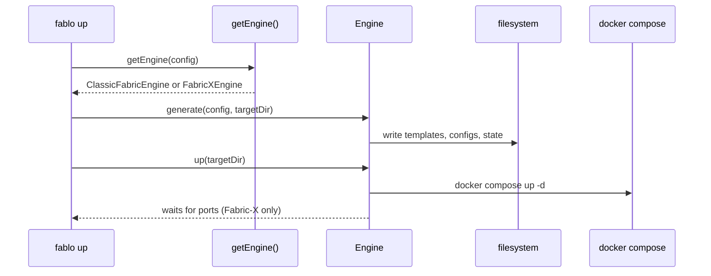

# Fablo + Hyperledger Fabric‑X Integration
## Engine Architecture - Proposal and Proof of Concept

**By Harshit Kandpal (`@HarK-github`)**  
**IIT Bhilai, B.Tech CSE**

## Overview

As part of my proposal for the LFDT mentorship project *"Fablo: Add support for Fabric‑X"*, I built a proof of concept that extends Fablo to support Hyperledger Fabric‑X networks **alongside** classic Hyperledger Fabric, without breaking or rewriting any existing classic workflow.

This document describes every architectural decision I made, why I made it, how I arrived at it through research, and what the resulting implementation looks like.

## How I Approached the Problem

Before writing a single line of code, I spent time understanding both codebases at the architectural level.

For **Fablo**, I traced the full generation pipeline: how a `fablo-config.json` is parsed, extended with defaults, validated, and then handed to `setupDocker()` which renders EJS templates into Docker Compose files and shell scripts. I noted that the entire pipeline assumes classic Hyperledger Fabric concepts: peers, orderers, certificate authorities, chaincode lifecycle, configtx. There is no seam for a different network type.

For **Fabric‑X**, I studied the token sample end‑to‑end: the `xdev` bundled topology, FSC‑based application nodes, `core.yaml` configuration, routing tables, the Arma orderer, validator‑committer, sidecar, and query service. Fabric‑X is not a new version of Fabric: it is a fundamentally different decomposed microservices architecture with a different deployment model, different config files, and a different runtime lifecycle.

The core insight from this research was: **these two systems share almost nothing at the generator level**. Trying to fit Fabric‑X into Fablo's existing generator by adding branches would create an unmaintainable tangle. What was needed was a clean boundary: an engine interface, so that classic Fabric and Fabric‑X could each own their generation and lifecycle logic independently.

## Evaluating the Architectural Options

The mentorship issue listed three possible integration paths: separate repo, pluggable engine, or wrapper approach. I evaluated all three before committing to a direction.

**Separate repo** (`fablo-fabricx`) would fragment the community immediately. Users would need to discover and maintain two different tools. Documentation would split. Version compatibility between the two repos would become a maintenance burden. Given that Fabric‑X is still evolving rapidly, tight iteration across two repos would be impractical. I ruled this out.

**Wrapper approach**: building a thin script that invokes Fabric‑X's native tooling is the fastest path to a demo but builds on an unstable foundation. Fabric‑X's native developer tooling is Ansible‑based and not designed to be wrapped. A wrapper would give users a fragmented experience (two tools, two config formats) and would need to be thrown away once the real engine was built. This produces throwaway technical debt.

**Pluggable engine in the same repo** is the approach taken by every successful infrastructure CLI tool that needed to support multiple backends: Terraform uses provider plugins behind a clean interface, Vagrant uses provider abstractions, Docker Compose uses a single engine with versioned schemas. The pattern is well‑established: define a contract, implement it per backend, route at the top level. This is the approach I chose.

However, I went one step further than a simple `if/else` branch inside `setupDocker()`. A true pluggable engine means the core CLI code has **no knowledge** of which engine it is talking to. Commands become platform‑agnostic. Adding a third engine in the future requires zero changes to core routing logic. This is the Open/Closed Principle applied to a CLI tool.

## The Key Architectural Decision: Schema‑First Engine Detection

The most important single decision I made was **how to detect which engine to use**.

My original proof of concept used `global.platform: "fabricx"` in the config. After reflection, I replaced this with `$schema` based detection. Here is why.

A `platform` field is an ad hoc convention. It has no validation semantics, no versioning, and no tooling support. It is also a leaky abstraction: it forces the `FabloConfigJson` type to know about Fabric‑X, coupling the classic type system to a new engine.

Using `$schema` follows an established convention used by JSON Schema, `tsconfig.json`, `package.json`, and many other config formats. It is self‑describing, version‑capable, and tooling‑friendly (editors can use it for autocompletion and validation). Most importantly, the schema field **identifies the config type** rather than being a runtime flag. The engine loader does not need to parse the config deeply: it only needs to check one field.

The detection rule I implemented is a strict suffix match:

```typescript
config.$schema?.endsWith("fabricx-schema-v1.json")
```

This is intentionally stricter than `.includes("fabricx")`. A suffix match is unambiguous and will not false‑positive on URLs that happen to contain the string in a path segment. The `v1` suffix also means future schema versions (`fabricx-schema-v2.json`) can be added without breaking existing configs.

There is **no `platform` field anywhere** in the final implementation: not in the config types, not in the engine loader, not in any command file.

### High level engine routing

```mermaid
flowchart TD
  A[Load config JSON/YAML] --> B{config.$schema endsWith<br/>fabricx-schema-v1.json?}
  B -->|Yes| C[FabricXEngine]
  B -->|No| D[ClassicFabricEngine]
  C --> E[generate(): write files only]
  C --> F[up(): docker compose only]
  D --> G[generate(): delegate to existing setup-network]
  D --> H[up/down/status: delegate to existing scripts]
```

## Repository Structure After the Refactor

```
fablo-repo/
├── src/
│   ├── commands/
│   │   ├── generate/index.ts     # engine-agnostic
│   │   ├── up/index.ts           # engine-agnostic
│   │   ├── down/index.ts         # engine-agnostic
│   │   ├── status/index.ts       # engine-agnostic
│   │   └── init/index.ts         # --fabricx flag added
│   ├── engines/
│   │   ├── engine.ts             # FabloEngine interface
│   │   ├── engine-loader.ts      # getEngine() factory
│   │   ├── classic/
│   │   │   └── index.ts          # ClassicFabricEngine (delegation wrapper)
│   │   └── fabricx/
│   │       ├── index.ts          # FabricXEngine
│   │       ├── schema/
│   │       │   └── fabricx-schema-v1.json
│   │       └── templates/
│   │           ├── docker-compose.xdev.yaml.ejs
│   │           ├── core.yaml.ejs
│   │           └── routing-config.yaml.ejs
│   ├── setup-docker/
│   │   └── index.ts              # Fabric-X branch removed
│   └── types/                    # platform field removed
├── e2e-network/
│   └── fabricx/
│       └── test-01-fabricx-simple.sh
└── (all other existing files unchanged)
```

The old `src/setup-docker/fabricx/` directory has been deleted. The `if/else` branch inside `src/setup-docker/index.ts` has been removed. Classic Fabric generation is completely unchanged.

## The Engine Interface

The contract that both engines must implement lives in `src/engines/engine.ts`:

```typescript
export interface ValidationResult {
  valid: boolean;
  errors: string[];
}

export interface FabloEngine {
  validate(rawConfig: unknown): ValidationResult;
  generate(config: any, targetDir?: string): Promise<void>;
  up(targetDir?: string): Promise<void>;
  down(targetDir?: string): Promise<void>;
  status(targetDir?: string): Promise<string>;
}
```

Key design decisions in this interface:

- `generate()` receives both the config and an explicit `targetDir`. The caller (CLI) owns the target directory decision, making it deterministic and testable.
- `up()`, `down()`, and `status()` receive only `targetDir`. They read the state file written by `generate()` to know what to start or stop. This separation means generate and up are independent operations, matching how Fablo already works for classic Fabric.
- `validate()` takes `unknown` deliberately: validation happens before config parsing, so the input type cannot be assumed.

## The Engine Loader

`src/engines/engine-loader.ts` is the only place in the codebase that knows about specific engines:

```typescript
import { FabloEngine } from "./engine";
import { FabricXEngine } from "./fabricx";
import { ClassicFabricEngine } from "./classic";

export function getEngine(config: any): FabloEngine {
  if (config.$schema?.endsWith("fabricx-schema-v1.json")) {
    return new FabricXEngine();
  }
  return new ClassicFabricEngine();
}
```

Every CLI command calls `getEngine(config)` and then calls methods on the returned engine. No command file contains any Fabric‑X specific logic.

## The Classic Fabric Engine

`src/engines/classic/index.ts` implements `FabloEngine` as a pure **delegation wrapper**. It does not rewrite or duplicate any classic Fabric logic. Instead:

- `generate(config, targetDir)` writes a `fablo-config.json` snapshot and delegates to the existing `setup-network` function.
- `up(targetDir)`, `down(targetDir)`, `status(targetDir)` delegate to `<targetDir>/fabric-docker.sh`, exactly as classic Fablo does today.

The goal was not to touch the classic pipeline at all. Every existing Fablo test should pass without modification because the classic engine is a thin wrapper, not a reimplementation.

## The Fabric‑X Engine

`src/engines/fabricx/index.ts` implements `FabloEngine` for Fabric‑X networks.

### Validation

Validation uses `ajv` against the bundled `fabricx-schema-v1.json`. The schema requires:

- `$schema` (string, must equal `https://fablo.io/schemas/fabricx-schema-v1.json`)
- `global.fabricVersion` (string)
- `fabricx.channelId`, `fabricx.namespace` (strings)
- `fabricx.infrastructure.image` (string)
- `fabricx.nodes` (array, each with `id`, `type`, `apiPort`, `p2pPort`)

In the current PoC implementation, the Fabric‑X engine requires all four infrastructure ports to be provided in `fabricx.infrastructure.ports` (even though the schema marks `ports` as optional). The generated sample config always includes it.

### Generation

`generate(config, targetDir)` writes all artifacts from config values: no hardcoded ports, image tags, channel IDs, or node names anywhere in the generator:

- `<targetDir>/docker-compose.xdev.yaml`: rendered from `docker-compose.xdev.yaml.ejs`
- `<targetDir>/conf/routing-config.yaml`: rendered from `routing-config.yaml.ejs`
- `<targetDir>/conf/<node.id>/core.yaml`: one per node, rendered from `core.yaml.ejs`
- `<targetDir>/fabricx-engine-state.json`: internal state file recording port assignments
- `<targetDir>/crypto/`: MVP shortcut, copied from pre generated Fabric‑X sample material

All templates live under `src/engines/fabricx/templates/` and are loaded via `path.join(__dirname, "templates", filename)`. They are completely independent from the classic Fabric templates.

### Up

`up(targetDir)` reads the state file written by `generate()`, then:

1. Runs `docker compose -f <targetDir>/docker-compose.xdev.yaml up -d`
2. Polls the orderer port and query port (from state file) until ready, with a 60‑second timeout
3. Throws a descriptive error if the timeout is exceeded

### Down and Status

- `down(targetDir)` runs `docker compose -f <targetDir>/docker-compose.xdev.yaml down`
- `status(targetDir)` runs `docker compose -f <targetDir>/docker-compose.xdev.yaml ps` and returns the formatted output

### Fabric‑X Infrastructure Components (MVP)

The current MVP targets the bundled `xdev` topology: a single container image that packages all Fabric‑X infrastructure services:

| Component | Purpose | Port config key |
|---|---|---|
| Arma Orderer | Transaction ordering | `ports.orderer` |
| Sidecar | Block delivery to FSC nodes | `ports.sidecar` |
| Query Service | State queries | `ports.query` |
| PostgreSQL | Ledger state database | `ports.database` |
| Validator‑Committer | Transaction validation and commit | internal |
| Coordinator | Orchestrates VC and sidecar | internal |
| Verifier | Cryptographic verification | internal |

## CLI Commands: Engine‑Agnostic

All four command files follow the same pattern after the refactor:

```
1. Read config file from disk
2. engine = getEngine(config)
3. targetDir = derive from config or use default
4. engine.generate(config, targetDir)   ← for generate and up
5. engine.up/down/status(targetDir)
```

No command file contains an `if` block for Fabric‑X. The engine boundary means commands are fully platform‑agnostic. Adding a third engine in the future requires only a new engine class and one line in the loader.

### CLI sequence (generate and up)



## Init Command: `fablo init --fabricx`

When `--fabricx` is passed, `fablo init` generates `fablo-config-fabricx.json` with:

- `$schema: "https://fablo.io/schemas/fabricx-schema-v1.json"` (no `platform` field)
- `global.fabricVersion: "x"`
- A complete `fabricx` section with `channelId`, `namespace`, `infrastructure`, and a sample `nodes` array (issuer, endorser, owner)

Classic `fablo init` (no flag) is completely unchanged and produces `fablo-config.json` for classic Fabric.

## Bug Fixed During Development

### Docker Volume Mount Conflict

During testing of `fablo up`, Docker threw the error:

> *"Are you trying to mount a directory onto a file (or vice-versa)?"*

The root cause was that `docker-compose.xdev.yaml.ejs` mounted both the `./crypto` directory and `sc-genesis-block.proto.bin` explicitly as separate volume entries. Docker interpreted the explicit file mount as conflicting with the directory mount that already included the same file.

The fix was to remove the redundant explicit file mount. The genesis block file is correctly included in the container via the parent directory mount `./crypto:/root/config/crypto`. This resolved the issue completely.

## Known Limitations (Explicit MVP Tradeoffs)

I am documenting these explicitly rather than hiding them, because they are isolated inside the Fabric‑X engine and can be addressed during the mentorship without touching classic behavior:

**Crypto material is not generated: it is copied from a pre generated Fabric‑X sample directory.** This is the largest MVP shortcut. Proper crypto generation for Fabric‑X will require understanding how FSC nodes and the Arma orderer establish identity, which is part of the full mentorship scope. The copy source can be overridden via:

```bash
FABLO_FABRICX_CRYPTO_SOURCE=/absolute/path/to/crypto
```

**Orderer identity defaults are sample‑based.** These can be overridden via:

```bash
FABLO_FABRICX_ORDERER_MSP_ID=<value>
FABLO_FABRICX_ORDERER_MSP_DIR_REL=<relative-path>
```

**The `ports` object in `fabricx.infrastructure` is required in practice** even though the schema marks it as optional. The generated sample config always includes it. Full port defaulting will be added in the mentorship.

**Only the `xdev` bundled topology is supported.** Multi‑org Fabric‑X topologies with separate committer, endorser, and orderer containers are out of scope for the MVP.

All of these limitations are isolated inside `src/engines/fabricx/`. They cannot affect classic Fabric behavior.

## E2E Test

`e2e-network/fabricx/test-01-fabricx-simple.sh` validates the full Fabric‑X workflow end‑to‑end, following the same pattern as Fablo's existing test scripts:

1. Build the repo (`npm install && npm run build`)
2. `npx fablo init --fabricx` → assert `fablo-config-fabricx.json` exists, contains `$schema`, does not contain `platform`
3. `npx fablo generate fablo-config-fabricx.json fablo-target/fabricx` → assert `docker-compose.xdev.yaml`, `routing-config.yaml`, and at least one `core.yaml` exist
4. `FABLO_LOCAL=true npx fablo up fablo-config-fabricx.json fablo-target/fabricx` → poll port 7050 until ready
5. Assert `docker ps` shows the committer container running
6. `npx fablo status ...` → assert output contains the container name and port
7. `npx fablo down ...` → assert container is gone
8. Cleanup temp workspace

## Running the Demo

```bash
# 1. Build
npm install
npm run build

# 2. Init
npx fablo init --fabricx

# 3. Generate artifacts
npx fablo generate fablo-config-fabricx.json fablo-target/fabricx

# 4. Start network
FABLO_LOCAL=true npx fablo up fablo-config-fabricx.json fablo-target/fabricx

# 5. Check status
npx fablo status fablo-config-fabricx.json fablo-target/fabricx

# 6. Tear down
npx fablo down fablo-config-fabricx.json fablo-target/fabricx
```

Manual verification:

```bash
# Container check
docker ps --filter name=committer --format "table {{.Names}}\t{{.Status}}\t{{.Ports}}"

# Port checks
nc -zv 127.0.0.1 7050 && echo "✓ Orderer reachable"
nc -zv 127.0.0.1 7001 && echo "✓ Query service reachable"
nc -zv 127.0.0.1 4001 && echo "✓ Sidecar reachable"
```

## What This Refactor Achieves

The original proof of concept made Fabric‑X run inside Fablo's shell. This refactor makes it a first‑class engine:

- Engine selection is schema driven and versionable: no runtime flags, no `platform` fields
- Classic Fabric behavior is preserved through delegation, not reimplementation: every existing test should pass
- Fabric‑X templates, schema, and generation logic are fully isolated and independently testable
- CLI commands are engine agnostic: a future third engine requires zero changes to command code
- Known limitations are documented and isolated, with clear override paths for the full mentorship implementation
