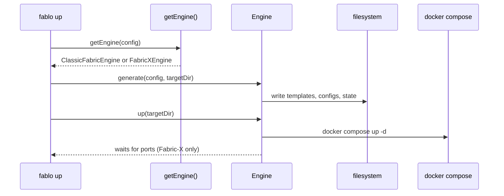

# Fablo + Hyperledger Fabric‑X Integration (Engine Architecture Proposal / PoC)

By Harshit Kandpal (`@Hark-github`)

## Overview

As a part of my proposal for this project, this document describes the end‑to‑end approach to extend Fablo to support Hyperledger Fabric‑X networks **alongside** classic Hyperledger Fabric, without breaking or rewriting the existing classic workflow.

The core idea is to refactor the proof‑of‑concept into a **clean engine architecture**:

- **Classic engine**: a real delegation wrapper that preserves 100% of existing Fabric behavior.
- **Fabric‑X engine**: a separate engine with its own schema, templates, and runtime lifecycle.
- **Engine detection**: based only on `$schema` **suffix match** (no `platform` field anywhere).

This makes Fabric‑X “pluggable” while keeping Fablo’s classic generator and lifecycle stable.

## Architecture Decision

Fablo’s existing generation pipeline is tightly coupled to classic Hyperledger Fabric concepts: peers, orderers, certificate authorities, configtx, crypto‑config, Docker Compose for Fabric components, and chaincode lifecycle scripts.

Fabric‑X uses a decomposed microservices architecture (orderer, committer, sidecar, query service, database) and FSC‑based application nodes configured via `core.yaml` plus a routing table.

Instead of adding more branching deep inside the classic generator, I implemented an **engine boundary**. This preserves backwards compatibility and keeps the Fabric‑X logic isolated and testable.

### High‑level engine routing

```mermaid
flowchart TD
  A[Load config JSON/YAML] --> B{config.$schema endsWith<br/>fabricx-schema-v1.json?}
  B -->|Yes| C[FabricXEngine]
  B -->|No| D[ClassicFabricEngine]
  C --> E[generate(): write files only]
  C --> F[up(): docker compose only]
  D --> G[generate(): delegate to existing setup-network]
  D --> H[up/down/status: delegate to existing scripts]
```

## Step 0 (Schema‑first): Why I introduced a Fabric‑X schema

I moved the Fabric‑X selection mechanism to be **schema‑first**.

Fabric‑X configs must set:

```json
{
  "$schema": "https://fablo.io/schemas/fabricx-schema-v1.json"
}
```

The schema is versioned and lives in:

- `src/engines/fabricx/schema/fabricx-schema-v1.json`

This avoids any `global.platform` approach and makes engine selection deterministic and explicit.

## Engine API: clean contract between CLI and generators

I introduced a minimal engine interface:

- `src/engines/engine.ts`

Key properties of the contract:

- `validate(rawConfig)` returns `ValidationResult` with structured errors.
- `generate(config, targetDir)` only writes files (no Docker commands).
- `up(targetDir)` only starts containers (may read files created in generate).
- `down(targetDir)` stops/removes containers.
- `status(targetDir)` returns a status string.

## Engine Loader: exact suffix detection

Engine selection is centralized in:

- `src/engines/engine-loader.ts`

Selection rule (strict):

- `config.$schema?.endsWith("fabricx-schema-v1.json")` → Fabric‑X engine
- otherwise → classic engine

There is no `platform` field in any config type or runtime detection.

## Fabric‑X Engine

Path:

- `src/engines/fabricx/index.ts`

### Validation

Fabric‑X validation uses `ajv` against `fabricx-schema-v1.json` (bundled via `resolveJsonModule`).

### Generation (file‑only)

`generate(config, targetDir)` writes:

- `<targetDir>/docker-compose.xdev.yaml`
- `<targetDir>/conf/routing-config.yaml`
- `<targetDir>/conf/<node.id>/core.yaml` (one per configured node)
- `<targetDir>/fabricx-engine-state.json` (engine internal state: selected ports)
- `<targetDir>/crypto/` (MVP: copied from a pre‑generated sample directory)

Templates are moved under the engine:

- `src/engines/fabricx/templates/docker-compose.xdev.yaml.ejs`
- `src/engines/fabricx/templates/core.yaml.ejs`
- `src/engines/fabricx/templates/routing-config.yaml.ejs`

This keeps the Fabric‑X template set self‑contained and independent from classic templates.

### Up (docker‑only)

`up(targetDir)` runs:

- `docker compose -f <targetDir>/docker-compose.xdev.yaml up -d`

Then it waits (max 60s) for the key ports defined in the generated state file:

- orderer port
- query port

### Down / Status

- `down(targetDir)` runs `docker compose ... down`
- `status(targetDir)` runs `docker compose ... ps` and returns its output

### Fabric‑X components used (current PoC)

This MVP uses a single “bundled committer” container image configured by the Fabric‑X config.

| Component | Purpose | Port source |
|---|---|---|
| Orderer | Transaction ordering | `fabricx.infrastructure.ports.orderer` |
| Sidecar | Block delivery | `fabricx.infrastructure.ports.sidecar` |
| Query Service | State queries | `fabricx.infrastructure.ports.query` |
| Database | Ledger DB | `fabricx.infrastructure.ports.database` |

## Classic Engine (delegation wrapper)

Path:

- `src/engines/classic/index.ts`

This engine is intentionally thin and delegates to existing classic behavior instead of re‑implementing logic:

- `generate(config, targetDir)`:
  - writes `fablo-config.json` snapshot into `<targetDir>`
  - invokes the existing classic command: `setup-network`
  - this keeps the classic generator unchanged and ensures identical outputs
- `up/down/status(targetDir)`:
  - delegates to `<targetDir>/fabric-docker.sh` (as classic Fablo already does)

The goal is that classic networks behave exactly as they did before this refactor.

## CLI Commands: engine‑agnostic and deterministic targetDir

I refactored the CLI to route through engines and removed the Fabric‑X conditional branches.

Commands:

- `src/commands/generate/index.ts`
- `src/commands/up/index.ts`
- `src/commands/down/index.ts`
- `src/commands/status/index.ts`

The CLI does:

1. Parse config
2. `const engine = getEngine(config)`
3. Determine `targetDir` (default depends on engine)
4. Call engine methods with an explicit `targetDir` (deterministic and testable)

### CLI sequence (generate + up)



## Init: `fablo init --fabricx`

`fablo init --fabricx` generates a Fabric‑X config file:

- output: `fablo-config-fabricx.json`
- `$schema`: `https://fablo.io/schemas/fabricx-schema-v1.json`
- contains only the fields required by the Fabric‑X schema (no `platform` field)
- includes a sample `nodes` array with issuer/endorser/owner

Classic `fablo init` (no flag) remains unchanged and produces `fablo-config.json` for classic Fabric.

## Cleanup: remove old Fabric‑X PoC wiring

As part of the engine refactor, I removed the old PoC code:

- Deleted directory: `src/setup-docker/fabricx/`
- Removed the Fabric‑X conditional block from: `src/setup-docker/index.ts`
- Removed `platform` field from types and config extension logic

This ensures Fabric‑X is not a “special branch” inside the classic generator anymore.

## E2E (Fabric‑X) test script

To validate the Fabric‑X workflow end‑to‑end, I added:

- `e2e-network/fabricx/test-01-fabricx-simple.sh`

This script:

1. Builds the repo
2. Runs `npx fablo init --fabricx`
3. Runs `npx fablo generate <config> <targetDir>`
4. Runs `FABLO_LOCAL=true npx fablo up <config> <targetDir>`
5. Verifies files, container name, and port readiness
6. Runs status and down

## Running the demo (end‑to‑end)

From the repository root (`fablo-repo`):

```bash
# 1. Build
npm install
npm run build

# 2. Init Fabric‑X config
npx fablo init --fabricx

# 3. Generate into deterministic target directory
npx fablo generate fablo-config-fabricx.json fablo-target/fabricx

# 4. Start Fabric‑X containers
FABLO_LOCAL=true npx fablo up fablo-config-fabricx.json fablo-target/fabricx

# 5. Status / Down
npx fablo status fablo-config-fabricx.json fablo-target/fabricx
npx fablo down fablo-config-fabricx.json fablo-target/fabricx
```

Note: `FABLO_LOCAL=true` is meaningful for `./fablo.sh` (it switches the script to run local sources instead of the published Docker image). For `npx fablo ...` it is harmless but not required.

## Verification commands (operator‑level)

```bash
# containers
docker ps --filter name=committer --format "table {{.Names}}\t{{.Status}}\t{{.Ports}}"

# ports (example: uses the ports configured in the Fabric‑X config)
nc -zv 127.0.0.1 7050 && echo "✓ Orderer reachable (7050)"
nc -zv 127.0.0.1 7001 && echo "✓ Query service reachable (7001)"
```

## Known limitations (explicit MVP tradeoffs)

To keep the PoC shippable and unblock engine architecture, I kept the following as MVP shortcuts:

- Crypto material is copied from a pre‑generated Fabric‑X sample directory.
  - Override source via `FABLO_FABRICX_CRYPTO_SOURCE=/abs/path/to/crypto`
- Orderer identity defaults are currently sample-based (override via env):
  - `FABLO_FABRICX_ORDERER_MSP_ID`
  - `FABLO_FABRICX_ORDERER_MSP_DIR_REL`

These are documented and isolated inside the Fabric‑X engine so they can be replaced with proper Fabric‑X crypto generation later without touching classic behavior.

In the current PoC implementation, the Fabric‑X engine requires all four infrastructure ports to be provided in `fabricx.infrastructure.ports` (even though the schema allows `ports` to be omitted). The generated sample config includes these ports by default.

## Summary (what this refactor achieves)

This refactor turns the original Fabric‑X hack into a clean engine architecture:

- Selection is schema‑driven and versionable.
- Classic behavior is preserved via delegation, not re‑implementation.
- Fabric‑X templates and generation are isolated and testable.
- CLI commands are engine‑agnostic and deterministic via explicit `targetDir`.

## Bug Fixes and Enhancements

### Resolved Docker Volume Mount Issue

**Problem**: During the `fablo up` phase, the Docker Compose configuration in `docker-compose.xdev.yaml.ejs` attempted to mount `sc-genesis-block.proto.bin` explicitly, in addition to mounting its parent `crypto` directory. This led to a Docker error where a file was being mounted over an already existing file (or conflicting with Docker's interpretation of a directory mount), resulting in the message: `Are you trying to mount a directory onto a file (or vice-versa)? Check if the specified host path exists and is the expected type`.

**Resolution**: The redundant explicit volume mount for `sc-genesis-block.proto.bin` was removed from `src/engines/fabricx/templates/docker-compose.xdev.yaml.ejs`. The file is correctly included in the container via the mount of its containing directory `./crypto:/root/config/crypto`. This ensures proper Docker volume behavior and allows the Fabric-X network to start successfully.
